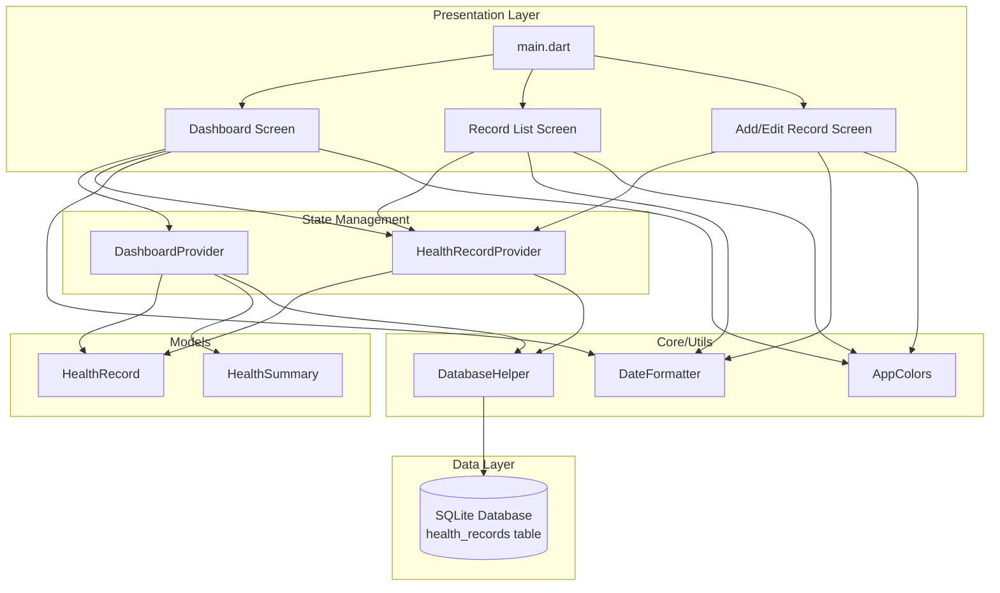

# HealthMate - Personal Health Tracker App

## Architecture & Design Documentation

### Application Architecture



### Folder Structure

```
healthmate/
├── lib/
│   ├── main.dart                          # App entry point with Provider setup
│   ├── core/
│   │   ├── constants/
│   │   │   └── app_colors.dart            # Color scheme constants
│   │   ├── database/
│   │   │   └── database_helper.dart       # SQLite database operations
│   │   └── utils/
│   │       └── date_formatter.dart        # Date formatting utilities
│   ├── features/
│   │   ├── dashboard/
│   │   │   ├── models/
│   │   │   │   └── health_summary.dart    # Summary data model
│   │   │   ├── providers/
│   │   │   │   └── dashboard_provider.dart # Dashboard state management
│   │   │   └── screens/
│   │   │       └── dashboard_screen.dart   # Main dashboard UI
│   │   └── health_records/
│   │       ├── models/
│   │       │   └── health_record.dart      # Health record data model
│   │       ├── providers/
│   │       │   └── health_record_provider.dart # Records state management
│   │       └── screens/
│   │           ├── add_record_screen.dart  # Add/Edit form
│   │           └── record_list_screen.dart # Records list with search
│   └── widgets/
│       └── stat_card.dart                  # Reusable stat card widget
```

### Database Schema

**Table: health_records**

| Column   | Type    | Constraints               | Description                 |
| -------- | ------- | ------------------------- | --------------------------- |
| id       | INTEGER | PRIMARY KEY AUTOINCREMENT | Unique record identifier    |
| date     | TEXT    | NOT NULL                  | Date in 'yyyy-MM-dd' format |
| steps    | INTEGER | NOT NULL                  | Number of steps walked      |
| calories | INTEGER | NOT NULL                  | Calories burned             |
| water    | INTEGER | NOT NULL                  | Water intake in milliliters |

**Sample Data:**

```sql
INSERT INTO health_records (date, steps, calories, water) VALUES
  ('2025-11-30', 5000, 250, 1500),
  ('2025-11-29', 8000, 400, 2000),
  ('2025-11-28', 6500, 325, 1800);
```

### State Management

**Provider Architecture:**

- **DashboardProvider**: Manages dashboard state and today's summary

  - Loads and calculates total metrics for current date
  - Provides refresh functionality
  - Handles loading and error states

- **HealthRecordProvider**: Manages health records CRUD operations
  - Load all records from database
  - Add new record with validation
  - Update existing record
  - Delete record
  - Filter/search by date
  - Manages list state with error handling

### Third-Party Libraries

| Library  | Version | Purpose                              |
| -------- | ------- | ------------------------------------ |
| provider | 6.1.1   | State management solution            |
| sqflite  | 2.3.0   | SQLite database for local storage    |
| path     | 1.8.3   | Path manipulation for database files |
| intl     | 0.18.1  | Date formatting and localization     |

### UI/UX Design

**Color Scheme:**

- **Primary Color**: Teal (#00897B) - Health/medical theme
- **Water Metric**: Blue (#2196F3)
- **Calories Metric**: Orange (#FF5722)
- **Steps Metric**: Green (#4CAF50)

**Key Features:**

1. **Dashboard Screen**

   - Displays today's aggregated health metrics
   - Curved header with gradient
   - Quick action buttons
   - Pull-to-refresh functionality

2. **Add/Edit Record Screen**

   - Date picker for selecting record date
   - Color-coded input fields
   - Real-time validation
   - Material Design form components

3. **Record List Screen**
   - Chronological list of all records
   - Filter by date functionality
   - Swipe-to-delete gesture
   - Tap-to-edit functionality
   - Empty state handling

### CRUD Operations Implementation

**1. Create (INSERT)**

```dart
Future<int> insertRecord(Map<String, dynamic> record) async {
  final db = await database;
  return await db.insert('health_records', record);
}
```

**2. Read (SELECT)**

```dart
// Get all records
Future<List<Map<String, dynamic>>> getAllRecords() async {
  final db = await database;
  return await db.query('health_records', orderBy: 'date DESC');
}

// Get records by date
Future<List<Map<String, dynamic>>> getRecordsByDate(String date) async {
  final db = await database;
  return await db.query('health_records', where: 'date = ?', whereArgs: [date]);
}
```

**3. Update**

```dart
Future<int> updateRecord(int id, Map<String, dynamic> record) async {
  final db = await database;
  return await db.update('health_records', record, where: 'id = ?', whereArgs: [id]);
}
```

**4. Delete**

```dart
Future<int> deleteRecord(int id) async {
  final db = await database;
  return await db.delete('health_records', where: 'id = ?', whereArgs: [id]);
}
- Snackbars for user feedback
- Circular progress indicators
- Icon consistency throughout the app
```
