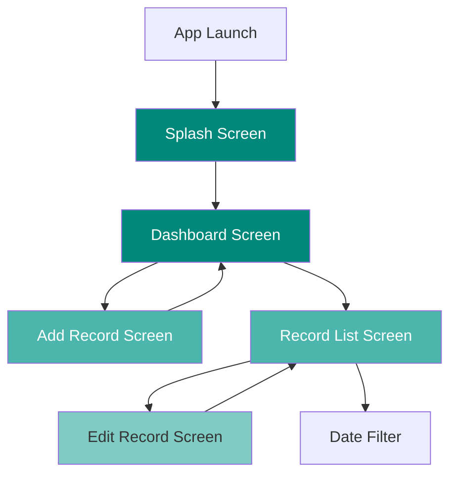
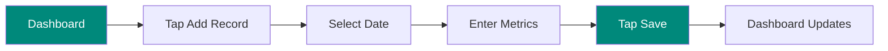
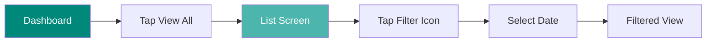
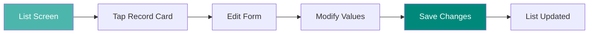

# HealthMate App Wireframes & UI Flow

## Table of Contents

1. [App Navigation Flow](#app-navigation-flow)
2. [Screen Wireframes](#screen-wireframes)
3. [User Flows](#user-flows)
4. [UI Components](#ui-components)

---

## App Navigation Flow

### Main Navigation Structure



---

## Screen Wireframes

### 1. Splash Screen

```
┌─────────────────────────────────┐
│                                 │
│         [Logo Animation]        │
│              ❤️                  │
│                                 │
│         HealthMate              │
│   Your Personal Health Tracker  │
│                                 │
│         [Loading...]            │
│                                 │
└─────────────────────────────────┘
```

**Features**:

- Animated heart logo with elastic bounce
- Gradient background (Teal → Dark Teal)
- Auto-transition after 3 seconds

---

### 2. Dashboard Screen

```
┌─────────────────────────────────┐
│ HealthMate           [❤️]      │ ← Curved Header
│ Monday, Nov 30                  │
│ Today's Health Summary          │
│                                 │
│ ┌────────┐ ┌────────┐           │
│ │ 👣 5k  │ │ 🔥 250 │           │
│ │ Steps  │ │  Kcal  │           │
│ └────────┘ └────────┘           │
│                                 │
│ ┌─────────────────────┐         │
│ │ 💧 1500 ml          │         │
│ │ Water Intake        │         │
│ └─────────────────────┘         │
│                                 │
│ Quick Actions:                  │
│                                 │
│ [➕ Add Health Record]          │
│                                 │
│ [📅 View All Records ]          │
│                                 │
│ ┌─────────────────────┐         │
│ │ ℹ️ Drink more water!│         │
│ └─────────────────────┘         │
└─────────────────────────────────┘
```

**Key Elements**:

- **Header**: App branding and current date
- **Stat Cards**: Color-coded metrics (Green Steps, Orange Calories, Blue Water)
- **Quick Actions**: Prominent buttons for common tasks
- **Info Card**: Daily health tip

---

### 3. Add/Edit Record Screen

```
┌─────────────────────────────────┐
│ ← Add Health Record             │ ← AppBar
├─────────────────────────────────┤
│                                 │
│  Date:                          │
│  ┌───────────────────────────┐  │
│  │ 📅 Nov 30, 2024        ▼  │  │
│  └───────────────────────────┘  │
│                                 │
│  ┌───────────────────────────┐  │
│  │ 👣 Steps Walked           │  │
│  │ [ e.g., 5000            ] │  │
│  └───────────────────────────┘  │
│                                 │
│  ┌───────────────────────────┐  │
│  │ 🔥 Calories Burned        │  │
│  │ [ e.g., 250             ] │  │
│  └───────────────────────────┘  │
│                                 │
│  ┌───────────────────────────┐  │
│  │ 💧 Water Intake (ml)      │  │
│  │ [ e.g., 1500            ] │  │
│  └───────────────────────────┘  │
│                                 │
│  [       SAVE RECORD       ]    │
│                                 │
└─────────────────────────────────┘
```

**Features**:

- Date picker (past dates only)
- Numeric input fields with validation
- Color-coded icons for each metric
- Large action button

---

### 4. Record List Screen

```
┌─────────────────────────────────┐
│ Health Records       [🔍] [❌]  │ ← AppBar
├─────────────────────────────────┤
│ Showing: Nov 30, 2024           │ ← Filter Banner
│                                 │
│ ┌─────────────────────┐         │
│ │ 📅 Nov 30    [Today]│         │
│ │ 👣 5000  🔥 250     │         │
│ │ 💧 1500 ml          │         │
│ └─────────────────────┘         │
│                                 │
│ ┌─────────────────────┐         │
│ │ 📅 Nov 29           │         │
│ │ 👣 8000  🔥 400     │         │
│ │ 💧 2000 ml          │         │
│ └─────────────────────┘         │
│                                 │
│  Swipe left to delete →         │
│                                 │
│                          [➕]   │ ← FAB
└─────────────────────────────────┘
```

**Features**:

- Chronological list (newest first)
- Filter by date functionality
- "Today" badge indicator
- Swipe-to-delete gesture
- Floating Action Button (FAB)

---

## User Flows

### Flow 1: Add Daily Record



**Steps**:

1. User taps "Add Health Record" on dashboard
2. Form opens with today's date selected
3. User enters steps, calories, and water
4. Validation checks inputs
5. Record saved to database
6. Dashboard refreshes with new totals

---

### Flow 2: View & Filter History



**Steps**:

1. Navigate to Record List
2. View all historical records
3. Tap filter icon in app bar
4. Select specific date from calendar
5. List updates to show only that date's records

---

### Flow 3: Edit Existing Record



**Steps**:

1. User taps a record card in the list
2. Form opens pre-filled with existing data
3. User modifies values
4. Saves changes
5. Returned to list with updated data

---

## UI Components

### Component Library

#### 1. Stat Card

```
┌──────────────┐
│     👣       │
│    5000      │
│    Steps     │
└──────────────┘
```

- **Usage**: Dashboard summary
- **Variations**: Green (Steps), Orange (Calories), Blue (Water)
- **Style**: Elevated card with icon and bold value

#### 2. Record Card

```
┌──────────────────────┐
│ 📅 Date      [Badge] │
│ 👣 Value  🔥 Value   │
│ 💧 Value             │
└──────────────────────┘
```

- **Usage**: History list
- **Style**: 3-column layout for metrics
- **Interaction**: Tap to edit, Swipe to delete

#### 3. Input Field

```
┌──────────────────────┐
│ Icon  Label          │
│ [ Input Area       ] │
└──────────────────────┘
```

- **Usage**: Add/Edit forms
- **Style**: Outlined border, color-coded icon prefix
- **Validation**: Error text appears below

---

## Responsive Design

### Breakpoints

| Device  | Width     | Layout Adjustments              |
| ------- | --------- | ------------------------------- |
| Mobile  | <600px    | Single column, stacked cards    |
| Tablet  | 600-900px | Grid layout for dashboard stats |
| Desktop | >900px    | Side-by-side list and details   |

### Adaptive Layouts

- **Dashboard**: Stat cards expand to fill available width
- **Forms**: Input fields maintain readable max-width
- **List**: Cards scale horizontally

---

## Color Scheme

### Primary Colors

- **Teal**: `#00897B` (Primary Brand)
- **Teal Light**: `#4DB6AC` (Accents)
- **Background**: `#F5F5F5` (Light Grey)

### Metric Colors

- **Steps (Green)**: `#4CAF50`
- **Calories (Orange)**: `#FF5722`
- **Water (Blue)**: `#2196F3`

---

## Typography

### Font Family

- **Primary**: Roboto (Material Default)

### Sizes

- **Headline**: 24px (Dashboard Header)
- **Title**: 20px (Screen Titles)
- **Body**: 16px (Input Text, List Items)
- **Caption**: 12px (Labels, Dates)

---

## Animations

### 1. Splash Screen

- **Logo**: Elastic scale animation (0.5 → 1.0)
- **Text**: Fade-in transition
- **Duration**: 1.5s animation + 1.5s delay

### 2. Page Transitions

- **Standard**: Material page slide transition
- **Dialogs**: Fade and scale

### 3. List Interactions

- **Swipe**: Red background reveal with delete icon
- **Refresh**: Pull-down circular indicator

---

**Last Updated**: December 1, 2024
**Project**: HealthMate - Personal Health Tracker
